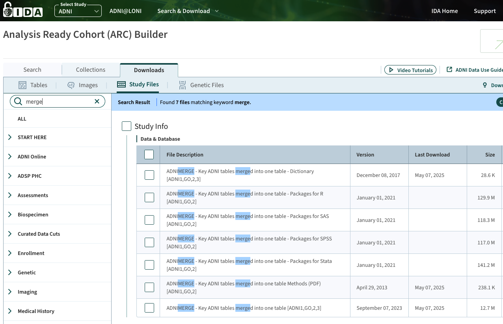

# Anonymous codes for the JPM paper (ML4H 2025)

>Note: All personally identifying information, including usernames, institutional paths, and package metadata, has been removed or anonymized to ensure double-blind compliance. Full reproducibility materials will be made available after the review process.

This repository is for the submission of "Joint Progression Modeling (JPM): A Probabilistic Framework
for Mixed-Pathology Progression". 

Note that the data generation and experiments are conducted on a high-performance computing platform, due to the large number of jobs to run. You can, however, modify relevant files to run on personal computers.

## Package

Our package codes are in the folder of `pympebm`. 

### Installation


```sh
pip install -r requirements.txt
cd pympebm
pip install -e .
cd ..
```

## How to generate synthetic data?


### Obtain theta/phi values of 18 biomarkers


Within `adni_norm_results`, there are the results of running EBM on the [ADNI](https://adni.loni.usc.edu/) data. The results are obtained by running `python3 run_adni.py`. It will use the `utils_adni.py` file.


In that folder, you can find `conjugate_priors` and `mle`. These two are slightly different algorithms, but the results are almost the same. We relied on the results of `conjugate_priors`.


The most important file is `conjugate_priors/results/adni_results.json`. These are the theta/phi parameters for the 18 biomarkers. We used them to generate synthetic data. This makes sure our synthetic data are as close to the real world as possible. The results are stored in `params.json`.


### How to get raw ADNI data?


In `run_adni.py`, you can see you need `ADNIMERGE.csv`. You can get it by [apply for data access through ADNI](https://adni.loni.usc.edu/data-samples/adni-data/#AccessData). They process requests within one week.


After you are granted the access, log in [https://ida.loni.usc.edu/login.jsp](https://ida.loni.usc.edu/login.jsp). Then go to [https://ida.loni.usc.edu/home/projectPage.jsp?project=ADNI](https://ida.loni.usc.edu/home/projectPage.jsp?project=ADNI). Click "Search & Download". In the dropdown menu, click "Study Files".


You'll see "Analysis Ready Cohort (ARC) Builder". In the search box, type "merge".





Download the following two files:


- ADNIMERGE-Key ADNI tables merged into one table [ADNI1,GO,2,3]


- ADNIMERGE-Key ADNI tables merged into one table - Dictionary [ADNI1,GO,2,3]


### Generate synthetic data


Related files are `gen.sh`, `run_gen.py`, `run_gen.sh`, and `run_gen.sub`.


To generate synthetic data, run `bash gen.sh`. The resulting folder and files will be


- `logs_gen` folder
- `true_order_and_stages_BT.json`
- `true_order_and_stages_Mallows_Tau_T1.0.json`
- `true_order_and_stages_Mallows_Tau_T10.0.json`
- `true_order_and_stages_Pairwise.json`
- `true_order_and_stages_PL.json`
- `true_order_and_stages_Random.json`


## How to study CLB, SEP, and SHP


In Section 4 of the paper, we studied calibration, separation and sharpness. In the following, I'll detail how we obtain simulation data and do the data analysis.


Related files are `run_meta.py`, `run_meta.sh`, and `run_meta.sub`.


Run `bash meta.sh` and the meta data in csv format will be saved into the folder of `metadata`. The log files will be saved into `logs_meta`.


The analysis notebook is `2025-09-08-analyze-meta.ipynb`.


## How to run synthetic experiments


Related files are `run_mlhc.py`, `run_mlhc.sh`, and `run_mlhc.sub`.


Run `bash run.sh` to run the experiments. All results will be saved to the folder of `algo_results`.


## How to analyze synthetic data results


Run `python3 save_csv.py`. You'll get all the results as `all_results.csv`.


For data analysis and visualizations, we used Observable. Since we cannot anonymize the notebooks, we are not able to share the codes at this point for the reviewing purpose.


## How to analyze the real-world NACC results


We are not able to share the codes now because we used a package that will disclose our identity. Without that, the codes are not reproducible, so there is no point to share them.


**We will share everything if the paper gets accepted.**


## Other files

- `config.yaml`: all hyper-parameters for our experiments.
- `gen_combo.py`: to generate filenames to be used in all `sh` files. The results will be `all_combinations.txt`. We also have `test_combinations.txt` for testing purposes.
- `failed_files.txt`, `missing_files.txt`, `na_combinations.txt` are the diagnostic files after running `python3 save_csv.py`.